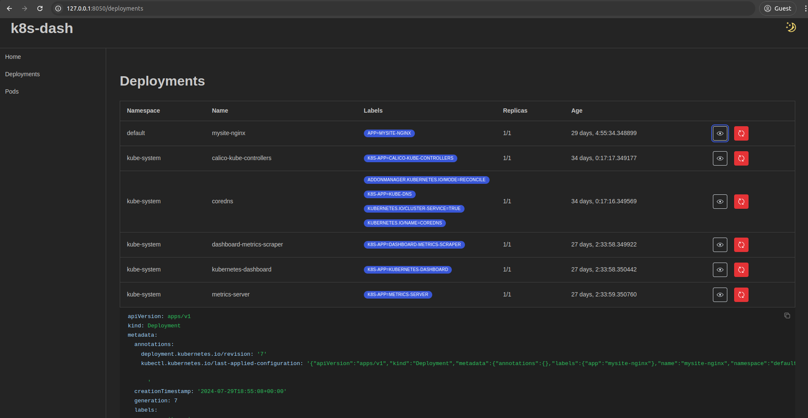

k8s-dash
---

A simple Kubernetes dashboard built in Python using [Dash](https://dash.plotly.com/) framework.

**Current features:**

- View all deployments, including their yaml definition
- Restart deployments
- View all pods, including their yaml definition
- Delete pods
- Basic Authentication

**Disclaimer:** I built k8s-dash for my own personal use and mostly for learning about the
Kubernetes API and the Dash framework.
So, k8s-dash is not intended to be used in production and I don't plan to extend it much more.

## Setup

Use the following steps to setup and run the app.

1. Clone the repository
2. Install the requirements (`pip install -r requirements.txt`). I suggest using a virtual environment.
3. Set the `K8S_DASH_ADMIN_PASSWORD` environment variable for basic authentication.
4. Run the app with `python app.py`

Note that the app will use the default kubeconfig file (`~/.kube/config`) to connect to the cluster.
